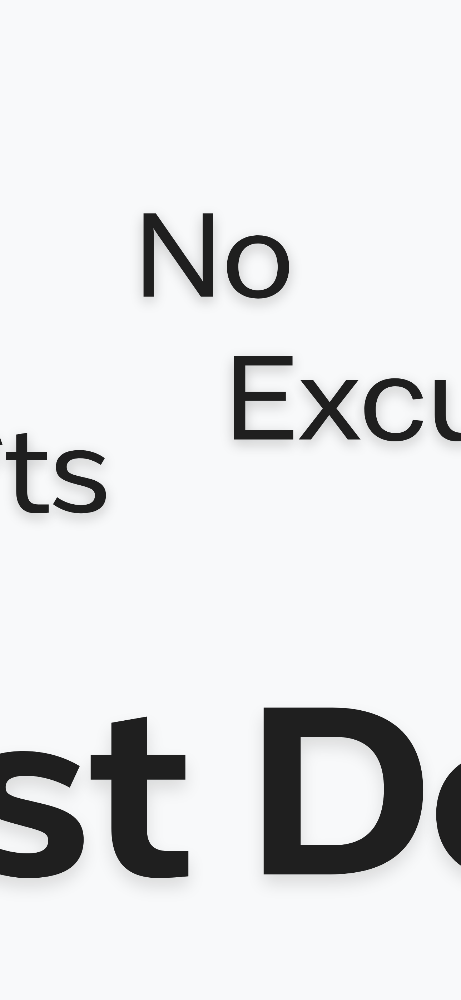

<!DOCTYPE html>
<html lang="en">
<head>
    <meta charset="UTF-8">
    <meta name="viewport" content="width=device-width, initial-scale=1.0">
</head>
<body>

<h1>JustDoIt - To Do List</h1>

Welcome to <strong>JustDoIt</strong>, the simplest and most efficient to-do list app designed to help you stay focused, organized, and productive. With no clutter and no distractions, JustDoIt is here to make sure you get things done quickly and easily!

<h2>Key Features</h2>
<ul>
    <li><strong>Easy to Use:</strong> Add tasks, organize them, and mark them as done. It’s that simple!</li>
    <li><strong>Stay Focused:</strong> Keep your mind on your tasks without unnecessary distractions or complicated features.</li>
    <li><strong>Track Your Progress:</strong> View the status of your tasks—completed, pending, or total—at a glance.</li>
    <li><strong>Prioritize with Ease:</strong> Organize your tasks based on what matters most to you, so you can focus on what’s important.</li>
    <li><strong>Dark and Light Themes:</strong> Choose from a variety of themes that best suit your style or environment.</li>
    <li><strong>Complete and Move Forward:</strong> Finish your tasks, remove them from the list, and keep your to-do list clean and clutter-free.</li>
</ul>

<h2>Why Choose JustDoIt?</h2>

<strong>JustDoIt</strong> is built for simplicity. It shows you only what matters, helping you stay on track without feeling overwhelmed. Whether you're at home, at work, or on the go, JustDoIt helps you get things done without unnecessary complexity.

<h2>How It Works</h2>
<ol>
    <li><strong>Add Tasks:</strong> Quickly add your tasks to the list.</li>
    <li><strong>Organize and Prioritize:</strong> Organize your tasks and set priorities based on importance.</li>
    <li><strong>Complete and Clear:</strong> Finish tasks, check them off, and remove them to keep your list neat.</li>
</ol>

<h2>Download JustDoIt</h2>

Ready to start checking things off your list? Download JustDoIt today:

<ul>
    <li><a href="https://apps.apple.com/tr/app/justdoit-to-do-list/id1234567890" target="_blank">Download on the App Store</a></li>
    <li><a href="https://play.google.com/store/apps/details?id=com.justdoit.app" target="_blank">Get it on Google Play</a></li>
</ul>

<h2>Screenshots</h2>

Here are some screenshots of the app in action:

<!-- Add your images here -->

</body>
</html>
